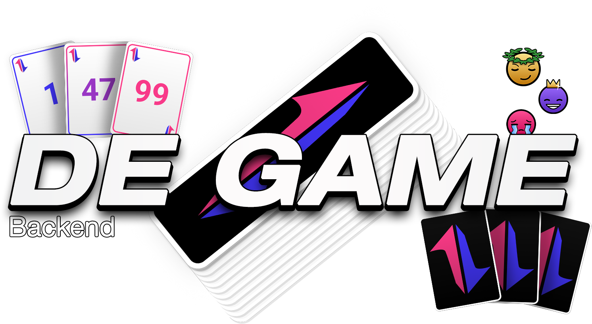

<p align="center">
	
</p>

Welcome to our version of Steffen Brendorff's card game "The Game" that promotes teamwork and having fun with eachother. This app was created as a part of the UZH-course "Software Engineering Lab".

## Table of contents
1. [Motivaiton & Game Rules](#motivation--game-rules)
2. [Technologies](#technologies)
3. [High-level components](#high-level-components)
4. [Launch & Deployment](#launch--deployment)
5. [Illustrations](#illustrations)
6. [Roadmap](#roadmap)
7. [Authors & Acknowledgement](#authors--acknowledgement)
8. [License](#license)

## Motivation & Game Rules

There is an existing card game called “The Game” by Steffen Brendorff that we played when first sitting together in our SoPra-group. We thought to ourselves that this is a very fun game that also lets a group of people get to know each other in a way that is not very typical. It allows the players to get to know the way of thinking of their group members. Additionally, we have not found an existing online version of “The Game” so this was definitely a hole we wanted to fill. <br>
Our version “De Game” is inspired heavily by “The Game”. It is an online version of the card game where all the players compete against De Game as a team. De Game contains 99 cards that each have a number on it, namely numbers 1 through 99. The goal of the game is to play the cards that are in the players hands in ascending order. It does not matter who plays their card when, there is no player order. As soon as the group decides a certain player has the lowest card, said player lays down their card. At the beginning of the first round, everyone receives one card (Level 1). When the cards in play are not played in the correct order there is no “level up” and the next round is again played in level 1. This means that every player again receives one card. An important point is that all the cards that were in play will no longer be in the game. They can be revealed which can help for people that are good at counting cards. When all the cards are played in the correct order the group of players levels up to the next level. In level two, every player receives two playing cards. This goes on until there are no longer enough cards on the stack to start a round in the corresponding level. <br>
Our SoPra-group likes to have fun and also to make fun of each other (in a respectful way, of course). Thus, we decided to add a fun feature, namely, “Shame Tokens”. When a player plays their card and it was not their turn because there is a lower card value in play, this player as well as the player holding the lowest card will receive a “Shame Token”. This gives the other players in the group a numeric value of shame that can be given to a player. It is important to notice that shame tokens are not something that is positive because De Game is a game that promotes teamwork. Collecting shame tokens is what leaves you on the “Loserboard” (opposite pole of usual leaderboards).


## Technologies

These are the technologies used in the server:
- [Java](https://www.java.com/en/)
- [Gradle](https://gradle.org/)
- [Spring Boot](https://spring.io/projects/spring-boot)
- [Google Cloud](https://cloud.google.com/?hl=en)
- [PostgreSQL](https://cloud.google.com/sql/docs/postgres)
- [Agora](https://www.agora.io/en/)

## High-level components

### GameLobbyController

The `GameLobbyController` is an important part of our implementation. It contains the functions `getGameLobby`, `createGameLobby`, `creatGame`, `addPlayer`, and `removePlayer`.

`getGameLobby`: checks if a GameLobby exists given its Game Pin. If it is found, the GameLobby is sent back to the frontend.

`createGameLobby`: creates a new GameLobby and assigns the User that demanded a new Lobby to be created the role of the `Admin`. The created GameLobby is sent back to the frontend.

`createGame`: creates a new Game. This is used to advance to the GameArena where De Game is played. The created game is returned to the frontend.

`addPlayer`: adds a User to the GameLobby if there are not yet 5 players in the game. If there are already 5 players in the lobby the GameLobby is still returned to the frontend but the User is not added to the Lobby.

`removePlayer`: removes a Player from the GameLobby and returns the GameLobby back to the frontend with a player less.

### GameService

The class `GameService` contains the games logic. Every move that is made by a player in the frontend first goes to the function `updateGamestatus` via the `GameController`. In the function `updateGamestatus` we try calling the function `doRound`. This function decides what happens next. 

- If it is a new game a card stack is created and cards are distributed to all the players. 
- If the previous move was a wrong move the cards in the hands of the players are deleted, shame tokens are distributed, and new cards are distributed.
- If a card is played `doRound` calls `doMove`. This function checks whether the move is right or wrong and acts accordingly.

### Game

The `Game` entity contains all the parts that De Game needs. This includes the game's `id`, `gamepin`, `cardstack`, `players`, `currentCard` (holds the value of the card that is being played), `successfulMove` (lets the frontend know what the game's status is).

## Launch & Deployment

### Setup this Template with your IDE of choice
Download your IDE of choice (e.g., [IntelliJ](https://www.jetbrains.com/idea/download/), [Visual Studio Code](https://code.visualstudio.com/), or [Eclipse](http://www.eclipse.org/downloads/)). Make sure Java 17 is installed on your system (for Windows, please make sure your `JAVA_HOME` environment variable is set to the correct version of Java).

#### IntelliJ
If you consider to use IntelliJ as your IDE of choice, you can make use of your free educational license [here](https://www.jetbrains.com/community/education/#students).
1. File -> Open... -> SoPra server template
2. Accept to import the project as a `gradle project`
3. To build right click the `build.gradle` file and choose `Run Build`

#### VS Code
The following extensions can help you get started more easily:
-   `vmware.vscode-spring-boot`
-   `vscjava.vscode-spring-initializr`
-   `vscjava.vscode-spring-boot-dashboard`
-   `vscjava.vscode-java-pack`

**Note:** You'll need to build the project first with Gradle, just click on the `build` command in the _Gradle Tasks_ extension. Then check the _Spring Boot Dashboard_ extension if it already shows `soprafs24` and hit the play button to start the server. If it doesn't show up, restart VS Code and check again.

### Building with Gradle
You can use the local Gradle Wrapper to build the application.
-   macOS: `./gradlew`
-   Linux: `./gradlew`
-   Windows: `./gradlew.bat`

More Information about [Gradle Wrapper](https://docs.gradle.org/current/userguide/gradle_wrapper.html) and [Gradle](https://gradle.org/docs/).

#### Build

```bash
./gradlew build
```

#### Run

```bash
./gradlew bootRun
```

You can verify that the server is running by visiting `localhost:8080` in your browser.

#### Test

```bash
./gradlew test
```

#### Development Mode
You can start the backend in development mode, this will automatically trigger a new build and reload the application
once the content of a file has been changed.

Start two terminal windows and run:

`./gradlew build --continuous`

and in the other one:

`./gradlew bootRun`

If you want to avoid running all tests with every change, use the following command instead:

`./gradlew build --continuous -xtest`

### Debugging
If something is not working and/or you don't know what is going on. We recommend using a debugger and step-through the process step-by-step.

To configure a debugger for SpringBoot's Tomcat servlet (i.e. the process you start with `./gradlew bootRun` command), do the following:

1. Open Tab: **Run**/Edit Configurations
2. Add a new Remote Configuration and name it properly
3. Start the Server in Debug mode: `./gradlew bootRun --debug-jvm`
4. Press `Shift + F9` or the use **Run**/Debug "Name of your task"
5. Set breakpoints in the application where you need it
6. Step through the process one step at a time

## Roadmap

### Shame Token Distribution Options
Enhance the functionality of shame token distribution by providing different options for determining who receives the token.

- **Non-contributor Penalty**: Automatically assign the shame token to the person who did not contribute to the discussion beforehand.
- **Voting System**: Allow players to vote on who should receive the shame token.

### Invitation Service
Introduce an invitation service to allow players to invite others from the overview directly into a lobby.

- **Instant Notifications**: Players receiving invitations will get them instantly via WebSocket.
- **Accept/Deny**: Accept or Deny invitation via Rest API.

### Game Variations
Expand the game's variety by introducing new options and modes.

- **Customizable Card Sets**: Allow players to add more cards, remove cards, or modify the card set.
- **Game Modes**: Implement different game modes where cards can appear in double/twice, or other unique variations.

## Authors & Acknowledgement

- [Valentin Ambass](https://github.com/kungfuvali)
- [Miguel Meier](https://github.com/usamike25)
- [Jenifer Meyer](https://github.com/jeniferleleanymeyer)
- [Paulin Roth](https://github.com/Paulin3000)
- [Kavishan Srirangarasa](https://github.com/kauii)

We thank our teaching assistant [Louis Caerts](https://github.com/LouisCaerts) for supporting us during the development of this application.

## License

The 2.0 version of the [`Apache License`](https://www.apache.org/licenses/LICENSE-2.0) was approved by th ASF in 2004.
